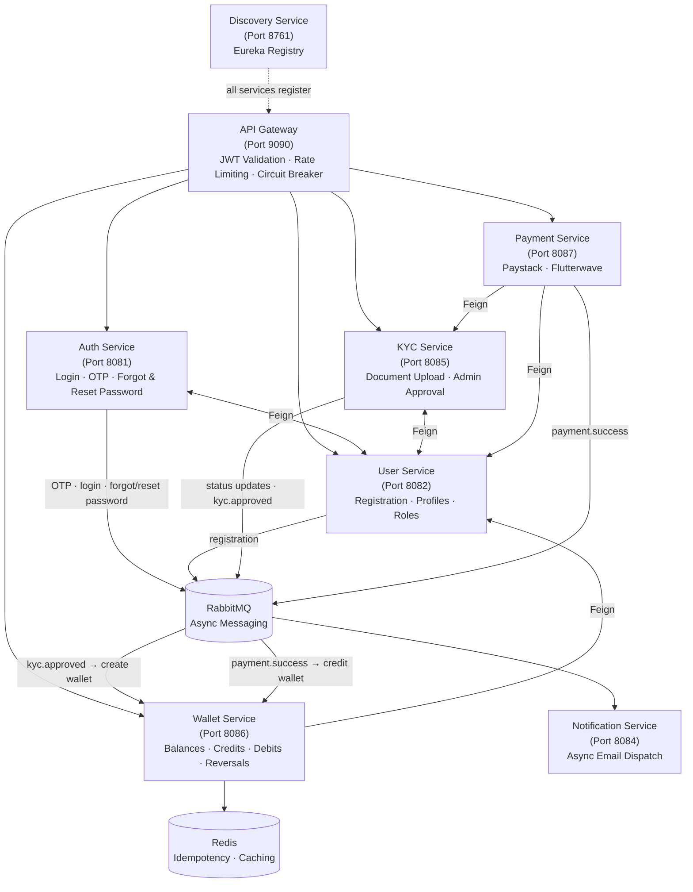

# GatePay — Microservices Payment Gateway

GatePay is a production-grade payment gateway built on a microservices
architecture using Java 17, Spring Boot 3, and Spring Cloud. It covers
the full lifecycle of a payment platform — user onboarding, JWT
authentication with OTP, KYC verification with document uploads,
multi-provider payment processing (Paystack & Flutterwave), event-driven
wallet management with idempotency and optimistic locking, and async
email notifications — across 8 independently deployable services
orchestrated via Docker Compose.
---

## Architecture



---

## Services

| Service | Port | Responsibility |
|---|---|---|
| `discovery-service` | 8761 | Eureka registry — every service registers here on startup |
| `gateway-service` | 9090 | Single entry point — routing, JWT validation, rate limiting, and circuit breaking |
| `auth-service` | 8081 | Issues and validates JWTs, handles OTP flows, login, and password reset |
| `user-service` | 8082 | User registration, profile management, and role assignment |
| `payment-service` | 8087 | Processes payments via Paystack and Flutterwave with automatic failover |
| `wallet-service` | 8086 | Manages user wallets — balances, credits, debits, reversals, and transaction history |
| `kyc-service` | 8085 | Document uploads via Cloudinary and admin KYC approval workflows |
| `notification-service` | 8084 | Consumes RabbitMQ events and dispatches transactional emails |

---

## Tech Stack

| Category | Technology |
|---|---|
| Language | Java 17 |
| Framework | Spring Boot 3, Spring Cloud |
| Service Discovery | Eureka (Netflix) |
| API Gateway | Spring Cloud Gateway |
| Messaging | RabbitMQ |
| Caching | Redis |
| Database | MySQL (isolated DB per service) |
| Migrations | Flyway |
| Authentication | JWT — access and refresh tokens |
| Resilience | Resilience4j — Circuit Breaker, Feign fallbacks |
| Payment Providers | Paystack, Flutterwave |
| File Storage | Cloudinary |
| API Documentation | Swagger / OpenAPI 3 |
| Distributed Tracing | Zipkin |
| Containerization | Docker, Docker Compose |

---

## Getting Started

### Prerequisites

- Docker and Docker Compose
- Java 17+
- Maven 3.9+

### 1. Clone the repository

```bash
git clone https://github.com/benard1991/gate-pay.git
cd gate-pay
```

### 2. Configure environment variables

Each service ships with a `.env.example`. Copy and fill in your credentials:

```bash
cp .env.example .env
cp auth-service/.env.example auth-service/.env
cp user-service/.env.example user-service/.env
cp payment-service/.env.example payment-service/.env
cp wallet-service/.env.example wallet-service/.env
cp kyc-service/.env.example kyc-service/.env
cp notification-service/.env.example notification-service/.env
cp gateway-service/.env.example gateway-service/.env
```

### 3. Enable Docker BuildKit

```bash
export DOCKER_BUILDKIT=1
export COMPOSE_DOCKER_CLI_BUILD=1
```

BuildKit caches Maven dependencies between builds. Without it, all services re-download their dependencies on every build — which can take 20–30 minutes. With it, subsequent builds are significantly faster.

### 4. Build and start all services

```bash
docker compose up --build
```

To run in the background:

```bash
docker compose up --build -d
```

The discovery service starts first. All other services register with Eureka before accepting traffic.

### 5. Service URLs

| Service | URL |
|---|---|
| Eureka Dashboard | http://localhost:8761 |
| API Gateway | http://localhost:9090 |
| Auth Service | http://localhost:8081 |
| User Service | http://localhost:8082 |
| Payment Service | http://localhost:8087 |
| Wallet Service | http://localhost:8086 |
| KYC Service | http://localhost:8085 |
| Notification Service | http://localhost:8084 |
| RabbitMQ Dashboard | http://localhost:15672 |
| Zipkin Tracing UI | http://localhost:9411 |

---

## API Documentation (Swagger)

Each service exposes its own interactive API documentation via Swagger UI. All endpoints can be explored and tested directly from the browser — no Postman required.

| Service | Swagger UI | OpenAPI JSON |
|---|---|---|
| Auth Service | http://localhost:8081/swagger-ui.html | http://localhost:8081/api-docs |
| User Service | http://localhost:8082/swagger-ui.html | http://localhost:8082/api-docs |
| Payment Service | http://localhost:8087/swagger-ui.html | http://localhost:8087/api-docs |
| Wallet Service | http://localhost:8086/swagger-ui.html | http://localhost:8086/api-docs |
| KYC Service | http://localhost:8085/swagger-ui.html | http://localhost:8085/api-docs |
| Notification Service | http://localhost:8084/swagger-ui.html | http://localhost:8084/api-docs |

> **Note:** The API Gateway (port 9090) handles routing and JWT validation. To test authenticated endpoints via Swagger, first call the login endpoint on auth-service to obtain a JWT, then click **Authorize** in the Swagger UI and paste the token.

---

## Wallet Service

The wallet service manages per-user wallets and all money movement across the platform. It is fully event-driven — wallets are created automatically when KYC is approved, and credited automatically when a payment is verified.

### Wallet Lifecycle

```
User registers
      ↓
User submits KYC documents
      ↓
Admin approves KYC
      ↓
kyc-service publishes KYC_APPROVED event
      ↓
wallet-service auto-creates wallet
      ↓
User gets email — "Your wallet is ready"
      ↓
User makes payment via payment-service
      ↓
payment-service publishes PAYMENT_SUCCESS event
      ↓
wallet-service auto-credits wallet
      ↓
User gets email — "Your wallet has been credited ₦X"
```

### Wallet API Endpoints

#### User Endpoints — `ROLE_USER`

| Method | Endpoint | Description |
|---|---|---|
| `GET` | `/api/v1/wallets/{userId}` | Get wallet balance |
| `POST` | `/api/v1/wallets/debit` | Debit wallet |
| `GET` | `/api/v1/wallets/{userId}/transactions` | Get paginated transaction history |
| `GET` | `/api/v1/wallets/transactions/{reference}` | Get transaction by reference |

#### Admin Endpoints — `ROLE_ADMIN`

| Method | Endpoint | Description |
|---|---|---|
| `POST` | `/api/v1/wallets/admin` | Manually create wallet |
| `GET` | `/api/v1/wallets/admin/{userId}` | Get any user's wallet |
| `POST` | `/api/v1/wallets/admin/credit` | Credit a wallet |
| `POST` | `/api/v1/wallets/admin/reverse/{reference}` | Reverse a transaction |
| `PATCH` | `/api/v1/wallets/admin/{userId}/suspend` | Suspend a wallet |
| `PATCH` | `/api/v1/wallets/admin/{userId}/reactivate` | Reactivate a wallet |
| `PATCH` | `/api/v1/wallets/admin/{userId}/close` | Close a wallet |
| `GET` | `/api/v1/wallets/admin/{userId}/transactions` | Get any user's transactions |

### Transaction Filters

The transaction history endpoint supports the following query parameters:

| Parameter | Type | Description |
|---|---|---|
| `type` | `CREDIT / DEBIT` | Filter by transaction type |
| `source` | `TOPUP / COMMISSION / TRANSFER / REVERSAL / REFUND / WITHDRAWAL` | Filter by source |
| `status` | `PENDING / SUCCESS / FAILED / REVERSED` | Filter by status |
| `from` | `LocalDateTime` | Start date filter |
| `to` | `LocalDateTime` | End date filter |
| `page` | `int` | Page number (default: 0) |
| `size` | `int` | Page size (default: 20) |

### Industrial Standards Applied

| Standard | Implementation |
|---|---|
| **Idempotency** | Every credit and debit requires a unique `idempotencyKey`. Duplicate requests return the cached response from Redis — no double charges |
| **Optimistic Locking** | `@Version` on the `Wallet` entity prevents race conditions on concurrent balance updates |
| **Double-entry** | Every transaction records `balanceBefore` and `balanceAfter` — full audit trail |
| **Dead Letter Queues** | All RabbitMQ queues have DLQs — failed messages are never lost |
| **Event-driven** | Wallet creation and credits are triggered by RabbitMQ events — no tight coupling to KYC or payment services |
| **Separation of concerns** | Admin and user endpoints are in separate controllers |

### RabbitMQ Events

| Event | Publisher | Consumer | Action |
|---|---|---|---|
| `kyc.approved` | kyc-service | wallet-service | Auto-create wallet |
| `payment.success` | payment-service | wallet-service | Auto-credit wallet |
| `wallet.credit` | wallet-service | — | Internal audit |
| `wallet.debit` | wallet-service | — | Internal audit |
| `wallet.reversal` | wallet-service | — | Internal audit |
| `wallet.created` | wallet-service | notification-service | Send email |
| `wallet.suspended` | wallet-service | notification-service | Send email |

---

## Distributed Tracing (Zipkin)

GatePay uses [Zipkin](https://zipkin.io) for distributed tracing. Every request that flows through the system — from the API Gateway through to downstream services — is automatically traced and recorded.

**Zipkin UI:** http://localhost:9411

### How to use it

1. Start all services with `docker compose up -d`
2. Make any API call through the gateway (e.g. login, register, initiate payment)
3. Open http://localhost:9411 in your browser
4. Click **Run Query** to see the latest traces
5. Click any trace to see the full request journey across services — including which service was called, in what order, and how long each hop took

### What you can trace

- End-to-end request flows across multiple services
- Latency breakdown per service
- Failed spans and error details
- Inter-service Feign client calls
- RabbitMQ message publishing latency

Zipkin sampling is set to **100%** in development (`probability: 1.0`) so every request is captured.

---

## Useful Commands

```bash
# Stop all services
docker compose down

# Stop and remove all data volumes
docker compose down -v

# Rebuild and restart a single service
docker compose build wallet-service && docker compose up -d wallet-service

# Tail logs for a specific service
docker compose logs -f wallet-service

# Check health status of all services
docker compose ps

# Connect to wallet MySQL database
mysql -h 127.0.0.1 -P 3310 -u root -p gatepay_wallet_service
```

---

## Testing

### Run all tests across all services

From the project root, run:

```bash
mvn clean test
```

This executes tests for every module in one shot. Before running integration tests, start the required dependencies:

```bash
docker compose up -d mysql-auth redis rabbitmq
```

### Run tests for a specific service

```bash
mvn clean test -pl auth-service
mvn clean test -pl user-service
mvn clean test -pl payment-service
mvn clean test -pl wallet-service
mvn clean test -pl kyc-service
mvn clean test -pl notification-service
```

### Run a specific test class

```bash
mvn clean test -pl auth-service -Dtest=OtpServiceImplIntegrationTest
```

### Test coverage status

| Service | Status |
|---|---|
| `auth-service` | ✅ Complete — unit and integration tests |
| `user-service` | 🔲 Pending |
| `payment-service` | 🔲 Pending |
| `wallet-service` | 🔲 Pending |
| `kyc-service` | 🔲 Pending |
| `notification-service` | 🔲 Pending |

---

## How It Works

### Authentication

All requests hit the API Gateway first. The gateway validates the JWT before forwarding to any downstream service. Auth-service handles token issuance, OTP generation, and password reset flows. Inter-service calls carry the JWT through Feign clients so authentication context is preserved end-to-end.

### Payments

Payment-service integrates with both Paystack and Flutterwave. If one provider fails, Resilience4j's circuit breaker trips and the request is handled gracefully rather than timing out. All transactions are idempotent — duplicate requests are detected and rejected. Every payment produces a full audit trail.

### Wallet

Wallet-service runs independently of payment-service. Wallets are created automatically after KYC approval via a RabbitMQ event. Credits happen automatically after payment verification via another RabbitMQ event. All balance mutations use optimistic locking to prevent race conditions, and every transaction is idempotent via Redis-backed idempotency keys. Admin reversals are available for correcting erroneous transactions.

### KYC

Users upload identity documents through the KYC service, which stores them via Cloudinary. Admins review and approve or reject submissions through a dedicated workflow. Redis is used to enforce idempotency on document submissions. On approval, a `kyc.approved` event is published to RabbitMQ which triggers automatic wallet creation.

### Notifications

No service sends emails directly. Auth, User, KYC, and Wallet publish events to RabbitMQ — covering registration, login, OTP, password reset, KYC status changes, and wallet operations. The notification service consumes those events and handles dispatch. This keeps services decoupled and makes it straightforward to extend the notification layer without touching upstream services.

### Resilience

The circuit breaker lives at the gateway level. When a downstream service becomes unhealthy, the circuit opens and a fallback response is returned immediately — preventing cascading failures across the system. The circuit moves through three states: `CLOSED` under normal operation, `OPEN` when the failure threshold is breached, and `HALF_OPEN` when testing whether the service has recovered. All RabbitMQ queues have Dead Letter Queues — failed messages are never silently dropped.

---

## Project Structure

```
gate-pay/
├── docker-compose.yml
├── pom.xml                      # Parent POM
├── .env.example
├── discovery-service/
├── gateway-service/
├── auth-service/
├── user-service/
├── payment-service/
├── wallet-service/
│   ├── src/main/java/com/gatepay/walletservice/
│   │   ├── client/              # Feign clients
│   │   ├── config/              # RabbitMQ, Security config
│   │   ├── controller/          # User and Admin controllers
│   │   ├── dto/                 # Request, Response, External DTOs
│   │   ├── enums/               # WalletStatus, TransactionType etc.
│   │   ├── exception/           # ErrorCode, GlobalExceptionHandler
│   │   ├── listener/            # KycEventListener, PaymentEventListener
│   │   ├── model/               # Wallet, WalletTransaction
│   │   ├── repository/          # WalletRepository, WalletTransactionRepository
│   │   └── service/             # WalletService, TransactionService, IdempotencyService, WalletEventService
│   ├── src/main/resources/
│   │   └── application.yml
│   ├── .env
│   ├── .env.example
│   └── Dockerfile
├── kyc-service/
└── notification-service/
```

---

## Environment Variables

Each service reads from its own `.env` file. Refer to the `.env.example` in each service directory for the required variables. Never commit `.env` files — they are git-ignored by default.

---

## Author

**Nwabueze Ifeanyi Benard**
Backend Engineer
[nwabuezebenard@gmail.com](mailto:nwabuezebenard@gmail.com)
Lagos, Nigeria