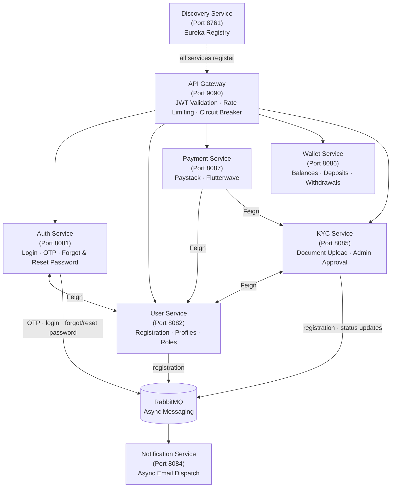

# GatePay — Microservices Payment Gateway

GatePay is a payment gateway built on a microservices architecture using Java 17, Spring Boot 3, and Spring Cloud. It covers the full lifecycle of a payment platform — user onboarding, authentication, KYC verification, payments, wallet management, and async notifications — across 8 independently deployable services.

---

## Architecture



---

## Services

| Service | Port | Responsibility |
|---|---|---|
| `discovery-service` | 8761 | Eureka registry — every service registers here on startup |
| `gateway-service` | 9090 | Single entry point — routing, JWT validation, rate limiting, and circuit breaking |
| `auth-service` | 8081 | Issues and validates JWTs, handles OTP flows, login, and password reset |
| `user-service` | 8082 | User registration, profile management, and role assignment |
| `payment-service` | 8087 | Processes payments via Paystack and Flutterwave with automatic failover |
| `wallet-service` | 8086 | Manages user wallets — balances, deposits, and withdrawals |
| `kyc-service` | 8085 | Document uploads via Cloudinary and admin KYC approval workflows |
| `notification-service` | 8084 | Consumes RabbitMQ events and dispatches transactional emails |

---

## Tech Stack

| Category | Technology |
|---|---|
| Language | Java 17 |
| Framework | Spring Boot 3, Spring Cloud |
| Service Discovery | Eureka (Netflix) |
| API Gateway | Spring Cloud Gateway |
| Messaging | RabbitMQ |
| Caching | Redis |
| Database | MySQL (isolated DB per service) |
| Migrations | Flyway |
| Authentication | JWT — access and refresh tokens |
| Resilience | Resilience4j — Circuit Breaker, Feign fallbacks |
| Payment Providers | Paystack, Flutterwave |
| File Storage | Cloudinary |
| API Documentation | Swagger / OpenAPI 3 |
| Distributed Tracing | Zipkin |
| Containerization | Docker, Docker Compose |

---

## Getting Started

### Prerequisites

- Docker and Docker Compose
- Java 17+
- Maven 3.9+

### 1. Clone the repository

```bash
git clone https://github.com/benard1991/gate-pay.git
cd gate-pay
```

### 2. Configure environment variables

Each service ships with a `.env.example`. Copy and fill in your credentials:

```bash
cp .env.example .env
cp auth-service/.env.example auth-service/.env
cp user-service/.env.example user-service/.env
cp payment-service/.env.example payment-service/.env
cp wallet-service/.env.example wallet-service/.env
cp kyc-service/.env.example kyc-service/.env
cp notification-service/.env.example notification-service/.env
cp gateway-service/.env.example gateway-service/.env
```

### 3. Enable Docker BuildKit

```bash
export DOCKER_BUILDKIT=1
export COMPOSE_DOCKER_CLI_BUILD=1
```

BuildKit caches Maven dependencies between builds. Without it, all services re-download their dependencies on every build — which can take 20–30 minutes. With it, subsequent builds are significantly faster.

### 4. Build and start all services

```bash
docker compose up --build
```

To run in the background:

```bash
docker compose up --build -d
```

The discovery service starts first. All other services register with Eureka before accepting traffic.

### 5. Service URLs

| Service | URL |
|---|---|
| Eureka Dashboard | http://localhost:8761 |
| API Gateway | http://localhost:9090 |
| Auth Service | http://localhost:8081 |
| User Service | http://localhost:8082 |
| Payment Service | http://localhost:8087 |
| Wallet Service | http://localhost:8086 |
| KYC Service | http://localhost:8085 |
| Notification Service | http://localhost:8084 |
| RabbitMQ Dashboard | http://localhost:15672 |
| Zipkin Tracing UI | http://localhost:9411 |

---

## API Documentation (Swagger)

Each service exposes its own interactive API documentation via Swagger UI. All endpoints can be explored and tested directly from the browser — no Postman required.

| Service | Swagger UI | OpenAPI JSON |
|---|---|---|
| Auth Service | http://localhost:8081/swagger-ui.html | http://localhost:8081/api-docs |
| User Service | http://localhost:8082/swagger-ui.html | http://localhost:8082/api-docs |
| Payment Service | http://localhost:8087/swagger-ui.html | http://localhost:8087/api-docs |
| Wallet Service | http://localhost:8086/swagger-ui.html | http://localhost:8086/api-docs |
| KYC Service | http://localhost:8085/swagger-ui.html | http://localhost:8085/api-docs |
| Notification Service | http://localhost:8084/swagger-ui.html | http://localhost:8084/api-docs |

> **Note:** The API Gateway (port 9090) handles routing and JWT validation. To test authenticated endpoints via Swagger, first call the login endpoint on auth-service to obtain a JWT, then click **Authorize** in the Swagger UI and paste the token.

---

## Distributed Tracing (Zipkin)

GatePay uses [Zipkin](https://zipkin.io) for distributed tracing. Every request that flows through the system — from the API Gateway through to downstream services — is automatically traced and recorded.

**Zipkin UI:** http://localhost:9411

### How to use it

1. Start all services with `docker compose up -d`
2. Make any API call through the gateway (e.g. login, register, initiate payment)
3. Open http://localhost:9411 in your browser
4. Click **Run Query** to see the latest traces
5. Click any trace to see the full request journey across services — including which service was called, in what order, and how long each hop took

### What you can trace

- End-to-end request flows across multiple services
- Latency breakdown per service
- Failed spans and error details
- Inter-service Feign client calls
- RabbitMQ message publishing latency

Zipkin sampling is set to **100%** in development (`probability: 1.0`) so every request is captured.

---

## Useful Commands

```bash
# Stop all services
docker compose down

# Stop and remove all data volumes
docker compose down -v

# Rebuild and restart a single service
docker compose build user-service && docker compose up -d user-service

# Tail logs for a specific service
docker compose logs -f auth-service

# Check health status of all services
docker compose ps
```

---

## How It Works

### Authentication

All requests hit the API Gateway first. The gateway validates the JWT before forwarding to any downstream service. Auth-service handles token issuance, OTP generation, and password reset flows. Inter-service calls carry the JWT through Feign clients so authentication context is preserved end-to-end.

### Payments

Payment-service integrates with both Paystack and Flutterwave. If one provider fails, Resilience4j's circuit breaker trips and the request is handled gracefully rather than timing out. All transactions are idempotent — duplicate requests are detected and rejected. Every payment produces a full audit trail.

### Wallet

Wallet-service runs independently of payment-service. It manages per-user balances and enforces deposit and withdrawal limits.

### KYC

Users upload identity documents through the KYC service, which stores them via Cloudinary. Admins review and approve or reject submissions through a dedicated workflow. Redis is used to enforce idempotency on document submissions.

### Notifications

No service sends emails directly. Auth, User, and KYC publish events to RabbitMQ — covering registration, login, OTP, password reset, and KYC status changes. The notification service consumes those events and handles dispatch. This keeps services decoupled and makes it straightforward to extend the notification layer without touching upstream services.

### Resilience

The circuit breaker lives at the gateway level. When a downstream service becomes unhealthy, the circuit opens and a fallback response is returned immediately — preventing cascading failures across the system. The circuit moves through three states: `CLOSED` under normal operation, `OPEN` when the failure threshold is breached, and `HALF_OPEN` when testing whether the service has recovered.

---

## Project Structure

```
gate-pay/
├── docker-compose.yml
├── pom.xml                      # Parent POM
├── .env.example
├── discovery-service/
├── gateway-service/
├── auth-service/
├── user-service/
├── payment-service/
├── wallet-service/
├── kyc-service/
└── notification-service/
```

---

## Environment Variables

Each service reads from its own `.env` file. Refer to the `.env.example` in each service directory for the required variables. Never commit `.env` files — they are git-ignored by default.

---

## Author

**Nwabueze Ifeanyi Benard**  
Senior Backend Engineer  
[nwabuezebenard@gmail.com](mailto:nwabuezebenard@gmail.com)  
Lagos, Nigeria